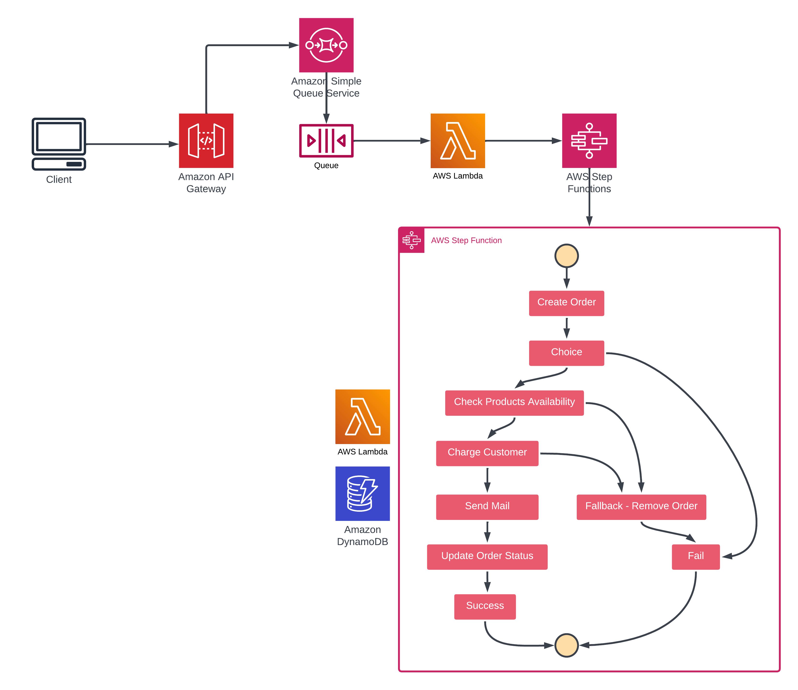

# Order Processing App

This is a small serverless application that process the order, builded in cloud on `event-driven` architecture
with the help of serverless [`SAM framework`](https://docs.aws.amazon.com/serverless-application-model/latest/developerguide/install-sam-cli.html) and [`AWS`](https://aws.amazon.com/ru/) infrastructure

**Used AWS services**:
- API Gateway
- SQS
- Lambda
- Step Functions
- DynamoDB
- CloudWatch Logs

### App architecture diagram


### Deploy application
```bash
#go to the root project directory
$ cd path/to/projectDirectory

#build an application with sam-cli
$ sam build

#deploy application to your AWS account
$ sam deploy --guided
```

### Test
Go to [`AWS API Gateway Console`](https://us-east-1.console.aws.amazon.com/apigateway/main/apis), select right api-gateway and copy it's public URL

Now you can send a `POST` request to the `/order` path with the same body structure:
```json
{
  "customerId": "1",
  "productsInfo": [
    {
      "id": "1",
      "count": 1
    },
    {
      "id": "2",
      "count": 1
    }
  ]
}
```

> [!WARNING]
> To get the result, you must create some items in `CustomerTable` and `ProductsTable`

### CustomersTable example item:
```json
{
  "id": "1",
  "fullName": "Name Surname",
  "email": "email@example.com",
  "balance": 1
}
```

### ProductsTable example item:
```json
{
  "id": "1",
  "name": "product1",
  "type": "type1",
  "price": 1,
  "count": 1
}
```